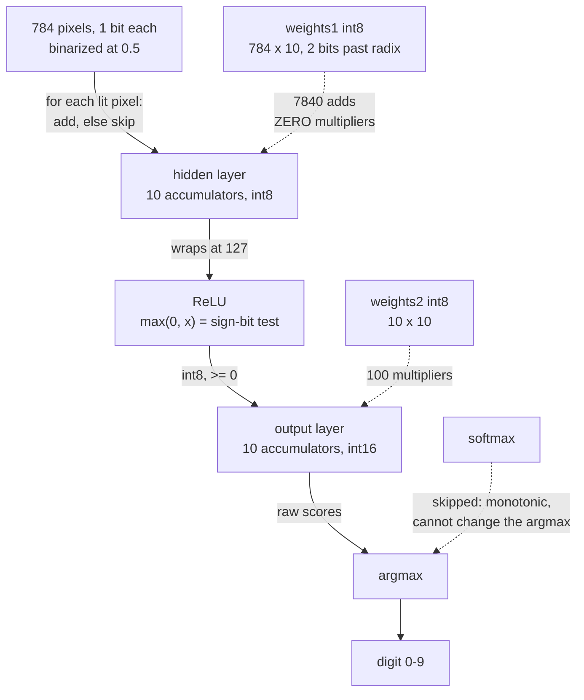

# Explanation: why this network runs on integers

Every design choice in this project traces back to one constraint: the finished
network has to be buildable out of redstone. Redstone is a digital logic
substrate. It has wires, comparators, repeaters, and adders. It has no floating
point unit, no exponential function, and no cheap multiplier. So the network was
not designed as a neural network that was later ported to redstone. It was
designed backwards, from the circuits available, into a network.

This document explains the reasoning. For the mechanics of the code, see
[Reference: `main.py` API](reference-api.md). For the circuits themselves, see
[Explanation: mapping the network to redstone](explanation-redstone-mapping.md).

---

## The problem

A conventional MNIST classifier does something like this per image:

```
784 float32 pixels x (784 x 128) float32 weights  =  100352 float multiplies
```

Then a sigmoid, involving `e^-x`, on every hidden unit. Then more multiplies,
then a softmax, involving ten more exponentials and a division.

Each of those operations is one instruction on a CPU and roughly free. In
redstone, each is a physical structure occupying real blocks and taking real
ticks:

- A **float multiplier** is enormous. Mantissa alignment, normalization, and
  rounding are each their own circuit.
- **`e^x`** has no closed-form circuit at all. You build a lookup table, which
  means a ROM addressed by the input, which means either a huge structure or a
  coarse approximation.
- **Division** for softmax is worse than multiplication.

Build the textbook network literally and you get a machine too large to
construct and too slow to watch. The failure is not subtle. It is the difference
between a build that fits in a world and one that does not.

---

## The approach

Four decisions, each removing one class of expensive circuit.

### 1. Binarize the input, and multiplication in layer 1 disappears

`clean_data` thresholds every pixel at 0.5, so each input is `0` or `1`.

Now look at what a hidden neuron computes:

```
sum over i of  weight[i] * pixel[i]
```

When `pixel[i]` is only ever 0 or 1, that product is either `weight[i]` or
nothing. The multiply collapses into a decision:

```
for index, pixel in enumerate(X):
    if pixel == 1:
        weight += weights[index]
```

That is the single highest-leverage choice in the project. The largest layer,
784 inputs wide, needs **zero multipliers**. It needs an adder and a gate. In
redstone terms, a lit pixel opens a path and lets that weight's value into the
accumulator.

The cost is real: thresholding throws away all grayscale information. MNIST
tolerates it well because the digits are high-contrast to begin with, and the
model is *trained* on binarized images rather than trained on grayscale and fed
binary at inference, so it never sees a distribution it was not fitted to.

### 2. ReLU instead of sigmoid, and the activation becomes a comparator

Sigmoid needs `e^-x`. ReLU is `max(0, x)`.

On a signed two's-complement number, `max(0, x)` is: look at the sign bit; if
it is set, output zero; otherwise pass the value through. One bit test and one
gate. There is nothing left to optimize.

The README's original claim of sigmoid activation described an earlier plan.
The code and the saved model both use ReLU, and for this project that is not a
downgrade. It is the reason the activation layer is nearly free.

### 3. Fixed point instead of floating point

`to_fixed` multiplies each weight by 4 and rounds:

```python
def to_fixed(float_value, bits_past_radix=2):
    a = float_value * (2 ** bits_past_radix)
    b = int(round(a))
    ...
```

The result is an ordinary integer that *means* a fraction. Store `13`, mean
`3.25`. Two bits sit past the binary point, so the resolution is 0.25 and the
`int8` range covers `-32.0` to `+31.75`.

The payoff is that fixed-point addition is just integer addition. Adding `3.25`
and `1.5` becomes adding `13` and `6` to get `19`, which reads back as `4.75`.
The adder does not know or care that there is a radix point. A plain binary
adder, the most basic redstone arithmetic circuit there is, gets you fractional
weights for free.

`to_fixed` also contains this:

```python
if a < 0:
    b = ~(abs(b)) + 1
```

Invert the bits and add one: the textbook definition of two's-complement
negation. In Python it returns exactly what `b` already held, so it changes
nothing. It is there as documentation of the operation the circuit performs, and
it is worth reading as a comment rather than as logic.

### 4. Drop softmax entirely at inference

`train_new_model` compiles with softmax and categorical crossentropy, because
training needs a probability distribution to compute a gradient against.

`forward` never applies softmax. It takes the argmax of the raw output values:

```python
prediction = np.where(output_out == np.max(output_out), 1, 0)
```

This is exact, not an approximation. Softmax is monotonic, so the largest logit
is always the largest probability. Ranking survives; only the numbers change.
Since classification only asks *which output is biggest*, the ten exponentials
and the division are pure waste. They are computed during training on a GPU,
where they cost nothing, and never built in redstone, where they would cost
everything.

---

## The resulting pipeline

Those four decisions produce this. Every box is a structure that has to exist in
redstone, and every edge label is a wire width or a cost:



The two dotted weight edges carry the whole argument. Binarizing the input moved
the multiplier count from 7840 to 100, and everything else follows from having
made that layer free.

Editable source: `diagrams/integer-inference-pipeline.excalidraw`.

---

## Accumulator width is the whole game

Here is the part that most repays attention, and the part that most easily
surprises.

The hidden accumulator starts as a Python `int` set to `0`, then immediately
becomes a NumPy `int8` on its first `+=` with an `int8` weight:

```python
weight = 0
for index, pixel in enumerate(X):
    if pixel == 1:
        weight += weights[index]      # weight is now np.int8
        check_overflow(weight, 8)
```

NumPy scalar arithmetic does not promote to a wider type here. It **wraps**.
Add 100 and 100 in `int8` and you get -56, not 200:

```
>>> np.int8(100) + np.int8(100)
np.int8(-56)          # RuntimeWarning: overflow encountered in scalar add
```

Two consequences follow.

**First, the simulation is honest.** An 8-bit redstone adder wraps exactly this
way. If the accumulator silently grew to 64 bits the way a Python `int` would,
the script would report an accuracy the hardware could never reproduce. The wrap
is the feature. It is what makes this a simulation of the build rather than a
sketch of it.

**Second, `check_overflow` cannot work as written.** By the time `weight` is
passed in, it has already wrapped and is inside `-128..127` by construction. The
test can never be true. The overflow does announce itself, but through NumPy's
`RuntimeWarning`, not through the function written to catch it. See
[How to tune the fixed-point format](howto-tune-fixed-point.md#making-overflow-detection-actually-work)
for the fix.

The output layer uses `int16` for a concrete reason. Its inputs are hidden
activations that can already be near the `int8` ceiling, and it multiplies
rather than gates, so products grow fast. Sixteen bits buys headroom exactly
where it is needed and nowhere else.

### The 8-bit ceiling, measured

The abstract argument above is testable, and the numbers are sharper than the
argument. Sweeping `bits_past_radix` over the full 10000-image test set against
the shipped weights:

| Fractional bits | Accuracy | Overflow events |
|---|---|---|
| 2 (the default) | 85.44% | 0 |
| 3 | **86.67%** | 1370 |
| 4 | 28.65% | 46538 |

Three things fall out of this table.

**The default is not the optimum.** Three fractional bits scores 1.2 points
higher than the shipped default of two. Finer weights are worth more than the
overflow they cost, right up until they are not.

**The cliff is a cliff, not a slope.** Between 3 bits and 4 bits, accuracy falls
from 86.67 percent to 28.65 percent. Doubling the scale doubles every partial
sum, the `int8` accumulator wraps on a third of the images instead of a tenth,
and a wrapped accumulator does not degrade a neuron gracefully. It inverts it.
A large positive sum becomes a large negative one, ReLU clamps it to zero, and
the neuron goes dark.

**Weight saturation is not the constraint here.** The largest absolute weight in
the shipped model is 1.6448, so nothing saturates on the `int8` cast until 7
fractional bits, long past the point where the accumulator has already
destroyed the result. For this model the accumulator is the binding limit, and
it is the only one worth designing around.

That is the practical takeaway for the redstone build. The choice of
`bits_past_radix` and the choice of accumulator width are the same decision,
and 8 bits of accumulator buys you exactly 2 or 3 bits past the radix.

---

## Trade-offs

| Given up | Bought | Notes |
|---|---|---|
| Grayscale input detail | No multipliers in the 784-wide layer | The single biggest circuit saving in the project. |
| Sigmoid's smooth gradient | Activation is one comparator | ReLU also trains faster; no real loss here. |
| Float precision | Adders instead of FPUs | Resolution drops to 0.25 per weight step. |
| Accuracy headroom | A build that physically fits | Measured: 92.37% in float, 85.44% through the integer pass. Just under 7 points is the price. |
| Silent-failure safety | Faithful 8-bit wrap semantics | Overflow corrupts a neuron quietly rather than raising. |
| A larger hidden layer | int8 accumulators stay in range | 10 hidden units is small for MNIST, and chosen for width, not capacity. |

The through-line: every row trades accuracy or convenience for circuit
simplicity. That is the correct trade for this project and the wrong one for
almost any other. If you are not building this in Minecraft, none of these
choices make sense.

---

## Alternatives considered

Reconstructed from the code and the project's stated goal rather than from
written design notes, so treat these as inference:

- **Larger hidden layer (the README mentions 16 to 32).** The shipped model uses
  10. A wider layer accumulates more terms into the same `int8`, which pushes
  toward overflow and forces either narrower weights or a wider accumulator, and
  a wider accumulator means more redstone per neuron.
- **More fractional bits.** `bits_past_radix` is a parameter with a default of 2,
  not a constant, which suggests it was tuned. The measurements above say 3 bits
  beats 2, so the default is likely conservative rather than optimal: it is the
  last setting that overflows *zero* times, which is a defensible thing to want
  from a circuit even at a small accuracy cost. Reproduce it with
  [How to tune the fixed-point format](howto-tune-fixed-point.md).
- **Quantization-aware training.** The model trains in float, then gets quantized
  afterward. Training with the quantization in the loop would recover accuracy at
  the cost of a much more involved training setup, and it does not change the
  circuit at all.

---

## Related

- [Reference: `main.py` API](reference-api.md)
- [Explanation: mapping the network to redstone](explanation-redstone-mapping.md)
- [How to tune the fixed-point format](howto-tune-fixed-point.md)
- [Tutorial: your first run](tutorial-first-run.md)
