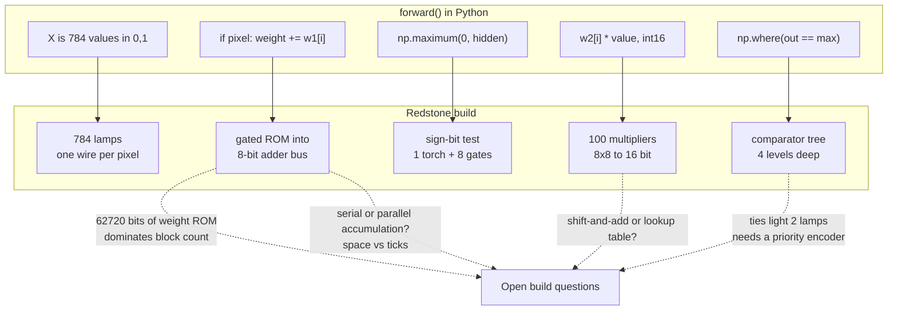

# Explanation: mapping the network to redstone

The Python in this repository is a specification. Every line of `forward()`
corresponds to a circuit that has to exist in the Minecraft build, and the
integer types are the wire widths. This document walks the correspondence.

> **Status: design target, not a shipped build.** The repository contains the
> simulator only. No schematic, no world save, no command-block generator. What
> follows is the circuit design the code implies, derived from reading
> `forward()`. Treat the block counts and tick estimates as order-of-magnitude
> planning figures, not measurements from a working machine.

Inspired by [MattBatWings](https://www.youtube.com/@MattBatWings), whose
redstone computing work is the reference point for this kind of build.

---

## The problem

A trained network is a pile of numbers plus a schedule of operations. Running it
on a CPU, both are invisible. In redstone, both are architecture:

- Every **weight** must be physically stored somewhere and readable on demand.
- Every **operation** must be a structure, and structures take ticks.
- Every **number** must have a fixed wire width chosen before you place a block.

Get the widths wrong and the machine produces confidently incorrect answers.
That is why the simulator uses `int8` and `int16` scalars that wrap rather than
Python integers that grow: the simulator is testing the wire widths, not just
the math.

---

## The correspondence

| `forward()` does | The build does |
|---|---|
| `X` is 784 values in `{0, 1}` | 784 input cells, each lit or unlit. One bit per pixel, one wire per pixel. |
| `if pixel == 1: weight += weights[index]` | A gate on each weight's ROM output feeding a shared accumulator bus. Lit pixel opens the gate. |
| `weights1` as `int8` | 7840 stored 8-bit values, addressed per neuron. |
| `weight += biases1.T[neuron]` | One more addend, wired permanently open. |
| `np.maximum(0, hidden_out)` | Sign-bit test. Set means clear the output to zero. |
| `weights2[index] * value` | A real 8x8 multiplier. Ten of them per output neuron. |
| `np.where(out == np.max(out), 1, 0)` | A 10-way comparator tree over `int16`. |
| `int8` accumulator wrapping | An 8-bit adder with no carry-out. The overflow is the hardware's, not a bug. |

The same mapping, drawn. Top row is what `forward()` executes; bottom row is the
structure each line becomes. The dotted edges are the parts still undecided:



Editable source: `diagrams/redstone-mapping.excalidraw`. The per-layer sketches
below go a level deeper on the wiring inside each of those bottom-row boxes.

---

## Layer by layer

### Input: 784 bits

Because `clean_data` binarizes at 0.5, a pixel is one bit. No signal-strength
encoding, no analog values on the wire. A 28x28 grid of lamps or levers is a
literal, watchable representation of the input, which also makes the machine
demonstrable: you can see the digit you are feeding it.

### Hidden layer: 10 neurons, no multipliers

This is the layer that would be impossible without binarization, and it is
almost trivial with it.

```
       pixel[0] ──┬── gate ── weight1[0][n] ──┐
       pixel[1] ──┬── gate ── weight1[1][n] ──┤
          ...                                 ├── 8-bit adder ── accumulator
     pixel[783] ──┬── gate ── weight1[783][n] ┤
                                bias1[n] ─────┘
```

Each of the 10 neurons walks 784 possible addends. Nothing multiplies. The
serial approach clocks the 784 weights past one adder, which is small in blocks
and long in ticks. The parallel approach builds an adder tree, which is fast and
enormous. This is the main space-versus-time decision in the whole build, and
the code does not settle it: the Python loop is inherently serial, but it is
simulating a value, not a schedule.

Weight storage dominates the block count either way. 7840 eight-bit values is
62720 bits of ROM, and that is before the second layer.

### ReLU: a sign-bit test

```
accumulator[7] (sign bit) ──── torch (invert) ──── enable
                                                     │
accumulator[6:0] ────────────── gate ────────────────┴──── output
```

Negative means the sign bit is set, which means the gate closes and zero comes
out. One inverter and eight gates per neuron. This is what
[choosing ReLU over sigmoid](explanation-integer-inference.md#2-relu-instead-of-sigmoid-and-the-activation-becomes-a-comparator)
bought.

### Output layer: 10 neurons, and here the multipliers appear

```python
weight += weights[index] * np.int16(value)
```

There is no way around a real multiplier here, because both operands vary. Ten
per output neuron, 100 total, each 8 bits by 8 bits producing 16.

That sounds bad until you compare it to the alternative. Had the *hidden* layer
needed multipliers, it would have needed 7840 of them. Binarizing the input
moved the multiplier count from thousands to a hundred. The `int16` accumulator
width follows directly: products of two `int8` values summed ten deep will not
fit in 8 bits.

### Argmax: a comparator tree

```
out[0] out[1]   out[2] out[3]   ...
   └──cmp──┘       └──cmp──┘
       └──────cmp──────┘
              └─── ... ───┘  ── winning index
```

Four levels deep for ten inputs. No exponentials, no division, no softmax,
because
[argmax over logits equals argmax over softmax](explanation-integer-inference.md#4-drop-softmax-entirely-at-inference).

One detail the simulator exposes: `np.where(out == np.max(out), 1, 0)` lights
*every* output holding the maximum. Ties produce multiple winners. In Python
that scores as a miss. In redstone it lights two lamps at once, which is a
display bug the build has to resolve with a priority encoder. Integer outputs
tie far more often than floats do, so this is worth designing for rather than
discovering.

---

## Trade-offs in the physical build

| Choice | Cost | Benefit |
|---|---|---|
| Serial accumulation | Slow. 784 clocked additions per neuron. | Small. One adder per neuron. |
| Parallel adder tree | Large. Hundreds of adders per neuron. | Fast. Logarithmic depth. |
| 8-bit hidden accumulator | Overflow corrupts neurons silently. | Halves the wire width everywhere in the widest layer. |
| 16-bit output accumulator | Wider comparator tree at the end. | Products cannot overflow. |
| ROM for weights | Weights are baked in. Retraining means rebuilding. | No writable memory needed anywhere. |
| Binary input display | Loses grayscale. | The input is directly visible and hand-settable. |

The overflow row deserves emphasis. The simulator wraps at `int8` on purpose so
that this failure shows up on a laptop, before it shows up as a neuron that
reads wrong in a structure that took weeks to place. Running `forward()` and
watching for NumPy's overflow warnings is the cheapest possible test of a wire
width. See
[How to tune the fixed-point format](howto-tune-fixed-point.md).

---

## What the simulator does not answer

Honest gaps, all of which are build decisions the Python cannot make:

- **Clock rate and schedule.** The code computes values, not timing. Nothing here
  tells you the tick budget.
- **Physical layout.** Block counts follow from the design; volume, orientation,
  and routing do not.
- **Weight loading.** The build presumably bakes weights into ROM, so retraining
  means rebuilding. A writable weight store is a different and much larger
  machine.
- **Multiplier design.** Shift-and-add versus lookup table is unresolved, and at
  100 instances it matters.

---

## Related

- [Explanation: why this network runs on integers](explanation-integer-inference.md)
- [Reference: `main.py` API](reference-api.md)
- [How to tune the fixed-point format](howto-tune-fixed-point.md)
